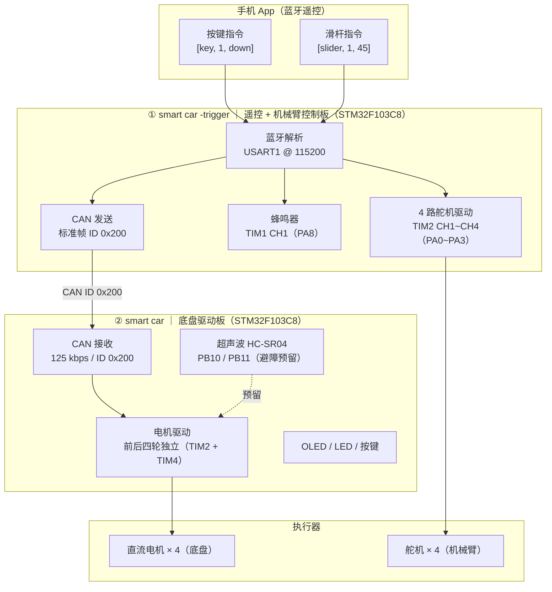

# 机械臂小车（Smart Car + Robotic Arm）

> 机器人及人工智能大赛参赛作品 —— 基于双 STM32F103 的蓝牙遥控四轮驱动小车 + 4 自由度机械臂。

[](LICENSE)

## 项目简介

本项目是一台「机械臂小车」：**四轮独立驱动的智能车底盘** 上搭载 **4 自由度机械臂**，通过 **手机 App（蓝牙）遥控** 完成底盘运动和机械臂夹取/抓放动作，两板之间使用 **CAN 总线** 通信。

- 底盘与机械臂分为 **两块 STM32F103C8T6 板卡**，职责清晰、互不干扰；
- 遥控端（trigger 板）解析蓝牙指令，本地驱动机械臂舵机与蜂鸣器，并把电机指令转发给底盘；
- 底盘端（smart car 板）执行 CAN 指令驱动四轮电机，预留超声波自动避障能力。

## 系统架构



> 更直观的静态版架构图见 [docs/architecture.html](docs/architecture.html)（浏览器打开即可查看）。

## 目录结构

```
robot-arm-car/
├── smart car/                 # 底盘驱动板工程（CAN 从机）
│   ├── Hardware/              #   HC-SR04 / 电机 / OLED / 舵机 / PWM / CAN / 按键 / LED
│   ├── User/                  #   main.c
│   ├── System/                #   延时
│   ├── Library/               #   STM32F10x 标准外设库
│   └── Start/                 #   启动文件与内核文件
├── smart car -trigger/        # 遥控 + 机械臂控制板工程（蓝牙主机）
│   ├── Hardware/              #   蓝牙 / 舵机 / 蜂鸣器 / PWM / CAN / OLED / 按键
│   ├── User/                  #   main.c
│   ├── System/                #   延时
│   ├── Library/               #   STM32F10x 标准外设库
│   └── Start/                 #   启动文件与内核文件
├── docs/
│   └── architecture.html      # 系统架构图（静态 HTML）
├── README.md
└── LICENSE
```

## 硬件清单

| 部件 | 型号/规格 | 数量 | 用途 |
| --- | --- | --- | --- |
| 主控 | STM32F103C8T6 最小系统板 | 2 | 底盘控制 / 遥控+机械臂控制 |
| 蓝牙模块 | HC-05 / HC-06（串口透传） | 1 | 接收手机 App 指令 |
| 直流电机 | 带减速箱 TT 电机 + 驱动 | 4 | 四轮驱动 |
| 舵机 | SG90 级 180° 舵机 | 4 | 机械臂关节 |
| 超声波 | HC-SR04 | 1 | 前方测距（避障预留） |
| 显示屏 | 0.96 寸 OLED (I2C/SPI) | 2 | 状态显示 |
| 蜂鸣器 | 有源/无源（PWM 驱动） | 1 | 提示音 / 音乐 |
| 电池 | 7.4V 锂电池组 | 1 | 供电 |

## 通信协议

### 蓝牙协议（手机 App → trigger 板）

数据包格式：`[标签, 参数1, 参数2]`，以 `[` 开头、`]` 结尾，逗号分隔。

| 数据包 | 功能 | 说明 |
| --- | --- | --- |
| `[key, 1, down]` | 前进 | 速度 +40（上限 100） |
| `[key, 2, down]` | 后退 | 速度 +40（上限 100） |
| `[key, 3, down]` | 原地右转 | 转向速度 100 |
| `[key, 4, down]` | 原地左转 | 转向速度 100 |
| `[key, 8, down]` | 停止 | 速度清零 |
| `[key, 6, down]` | 蜂鸣器音乐 | 播放《洒水车》 |
| `[key, 7, down]` | 蜂鸣器停止 | 停止播放 |
| `[slider, N, value]` | 机械臂关节 | N = 1~4 对应舵机 1~4，value = 0~180° |

### CAN 协议（trigger 板 → smart car 板）

标准帧，ID `0x200`，波特率 125 kbps（CAN 预分频 48，BS1=2tq，BS2=3tq，36MHz 时钟）。

| Data[0]（指令） | 动作 | Data[1]（参数） |
| --- | --- | --- |
| 0x01 | 前进 | 速度 0~100 |
| 0x02 | 右转 | 转向速度 |
| 0x03 | 左转 | 转向速度 |
| 0x04 | 后退 | 速度 0~100 |
| 0x05 | 避障动作 | 预留 |

## 快速开始

1. **编译烧录**：使用 Keil MDK5 分别打开两个工程的 `Project.uvprojx`，编译并下载到对应的两块 STM32 板：
   - `smart car/Project.uvprojx` → 底盘板
   - `smart car -trigger/Project.uvprojx` → 遥控+机械臂板
2. **上电**：两板先上电，OLED 显示 `System Ready` / `Car+Arm Control`；
3. **连接蓝牙**：手机安装任意「蓝牙串口助手」App，连接蓝牙模块（默认波特率 115200）；
4. **遥控**：在 App 中发送按键/滑杆指令即可控制小车与机械臂。

## 已知问题（Known Issues）

- `smart car -trigger/User/main.c`：slider 分支末尾会将机械臂 4 个角度强制重置为 38°/180°/60°/60°，导致每次收到滑杆包后刚调节的角度被复位，疑似笔误；
- `smart car -trigger/User/main.c`：主函数未调用 `Buzzer_Init()`，按键 6 的蜂鸣器播放可能无声；
- `smart car/User/main.c`：已声明自动避障模式与超声波测距函数，但主循环尚未接入避障逻辑（`front_dis` 恒为 0）；
- `smart car/Hardware/Servo.c`：引用了 `PWM_SetServoCompare3`，但该工程 `PWM.c` 中无此函数定义，需确认该文件是否实际参与编译。

## License

[MIT](LICENSE) © 2026 XZH0723-xzh
